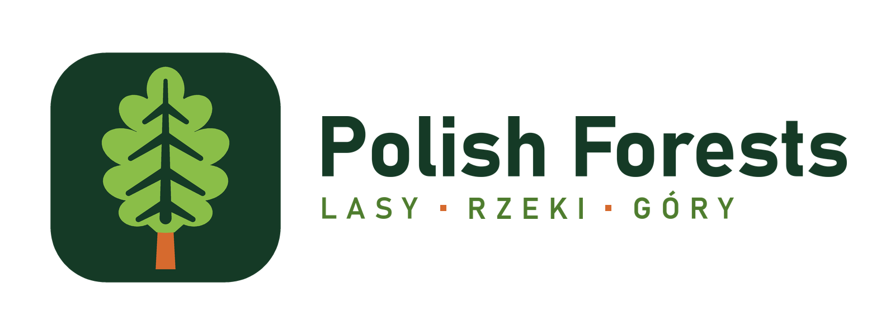

# Polish Forests (dawniej „Przyrodniczo zgodne lasy”)

<p align="center"></p>

Mod do Minecrafta 26.3 (Fabric), który generuje proceduralne krajobrazy Polski w skali 1:1 z przyrodniczo wiernymi lasami, florą i fauną oraz integracją z porami roku Serene Seasons.

Stan: za nami M0, M1, skala rozgrywki oraz etap rzek, dolin i morza; trwa M2 (biomy, siedliska, gleby i temperatura), zrobiona jest faza 1 (kroki S0–S4: klasyfikator 36 biomów). Kod i teksty w grze są po angielsku (polski jako tłumaczenie), dokumentacja po polsku. Licencja: MIT. Plan i decyzje są w katalogu `docs`.

## Dokumentacja

| Plik | Zawartość |
|---|---|
| `docs/00-decyzje-do-podjecia.md` | decyzje projektowe, podjęte i otwarte |
| `docs/01-architektura.md` | architektura i kamienie milowe |
| `docs/02-wydajnosc.md` | pomiary wydajności, zalecana paczka modów i ustawienia |
| `docs/03-m2-biomy.md` | plan kamienia milowego M2: 36 biomów, strefy nadwodne, piętra, gleby, temperatura |
| `docs/research/` | raporty badawcze: geografia, lasy, fauna, klimat, technika |
| `docs/m1/` | podglądy modelu krajobrazu i zrzuty ekranu z gry po M1 |
| `docs/rzeki-i-morze/` | podglądy i zrzuty po etapie rzek, dolin i morza |
| `docs/m2/` | podglądy siedlisk M2, udziały biomów i stref, pomiary bazowe |

## Wymagania

- JDK 25 lub nowszy (projekt kompiluje się z `--release 25`, np. zainstalowanym JDK 26).
- Gradle nie jest potrzebny, bo projekt zawiera wrapper.

## Polecenia

Wszystkie polecenia uruchamia się w katalogu projektu. Gradle sam używa JDK wskazanego w `gradle.properties` przez `org.gradle.java.home`, niezależnie od domyślnej Javy w systemie. Na innym komputerze trzeba tam wpisać ścieżkę do własnego JDK 25 lub nowszego.

```bash
./gradlew build
```

Kompiluje mod i uruchamia testy jednostkowe modelu krajobrazu. Gotowy plik jest w `build/libs`.

```bash
./gradlew fastTest    # szybkie testy (bez klas oznaczonych @Tag("slow")), ok. 1 min
./gradlew test        # wszystkie testy oprócz pomiaru kosztu, w 3 równoległych procesach
./gradlew costTest    # pomiar kosztu SampleCostTest, sam w jednej JVM
```

Zasady pracy, testy i skrypt `tools/dev/run-tests` (ponowne użycie wyników przy niezmienionym drzewie) opisuje `docs/BRIEF.md`.

```bash
./gradlew landscapePreview
```

Renderuje model krajobrazu do `build/preview/*.png` bez uruchamiania gry i wypisuje statystyki nachyleń gór.

```bash
./gradlew runClientGameTest -Pgametest=all
```

Uruchamia prawdziwego klienta i testy w grze, a zrzuty ekranu zapisuje do `build/run/clientGameTest/screenshots`. Zamiast `all` można podać `ui` (ekran opcji i komendy), `performance` (porównanie z wanilią), `views` (przegląd krajobrazów), `stages` (czasy etapów generacji chunka) albo `climate` (temperatura i śnieg w obu skalach). Dopisek `-Psites=beach,cliff` ogranicza widoki do wybranych miejsc (nazwy w `PolandWorldClientGameTest`).

```bash
python tools/build_mrpack.py
```

Po `./gradlew build` buduje zalecaną paczkę modów `.mrpack` w `build/distributions`.

```bash
./gradlew runClient
```

Uruchamia grę w trybie deweloperskim. Z flagą `-Poptimization` dołącza mody z zalecanej paczki.

## W grze

Świat tworzy się na zakładce „Świat”. Do wyboru są dwa typy świata:

| Typ świata | Krajobrazy | Wysokości | Dla kogo |
|---|---|---|---|
| Poland (1:1 Scale), po polsku „Polska (skala 1:1)”, `polishforests:poland` | rzeczywiste, makroregiony ok. 64 km | 1:1 do ok. 900 m, Rysy na Y 2000 | wierność i dalekie wyprawy |
| Poland (Gameplay Scale), po polsku „Polska (skala rozgrywki)”, `polishforests:poland_gameplay` | ok. 1,4 km, ok. 2 razy więcej niż biom wanilijny | obniżone proporcjonalnie, Rysy na Y ok. 690 | zwykła gra, słabszy komputer |

Przycisk „Dostosuj” otwiera opcje generowania: skalę, rozmiar regionów, tryb krajobrazu, udział lasów gospodarczych i gatunki obce.

| Komenda | Działanie |
|---|---|
| `/polishforests find <target>` | najbliższy krajobraz lub forma terenu z klikalnymi współrzędnymi |
| `/polishforests list` | klikalna lista 31 celów w pięciu grupach |
| `/polishforests elevation <from> <to>` | najbliższy teren o wysokości w przedziale, w m n.p.m. |
| `/polishforests highest [radius_km]` | najwyższy punkt w okolicy |
| `/polishforests here` | krajobraz, wysokość, podłoże, wody i formy terenu pod graczem |

Do M2-9 komendy i cele miały polskie nazwy (`/polskielasy znajdz <cel>` itd.); zestawienie dawnych nazw jest w `docs/01-architektura.md`, sekcja 14.

Cele:
- krajobrazy: outwash_plain, moraine_plateau, old_glacial_plain, foothills, beskids, sea, coastland;
- piętra górskie: lower_montane, upper_montane;
- wody i mokradła: river, lake, tunnel_valley_lake, kettle_pond, peatland, stream, headwaters, oxbow_lake, lagoon, river_mouth;
- wybrzeże morskie: beach, coastal_dunes, cliff;
- formy terenu: river_valley, valley_slope, tunnel_valley, inland_dunes, end_moraine, ridge, summit, mountain_pass, mountain_valley.

Rzeki meandrują zależnie od spadku terenu, zostawiają starorzecza i uchodzą do morza. Wybrzeże ma plaże, klify, wydmy i zalewy.

Informacje o krajobrazie są też na ekranie F3.

## Zależności

| Mod | Wersja | Status |
|---|---|---|
| Fabric API | 0.161.0+26.3 | wymagany |
| GeckoLib | 5.5.7 | wymagany |
| SmartBrainLib | 2.0.2 | wymagany |
| Serene Seasons | 26.1.2.0.7 | opcjonalny, bez niego działa własny kalendarz |

## Logo

Znak: liść dębu szypułkowego z wyciętym w nerwach świerkiem, na pniu w kolorze kory sosny. Pliki w `docs/logo/` (wersje z hasłem po polsku `_pl` i po angielsku `_en`, na jasne i ciemne tło, znak w SVG), ikona moda w `src/main/resources/assets/polishforests/` (16–512 px; 16 i 32 px rysowane ręcznie jako pixel art). Źródła: `tools/logo/` (`python tools/logo/build.py`, czcionka Bahnschrift z Windows).
